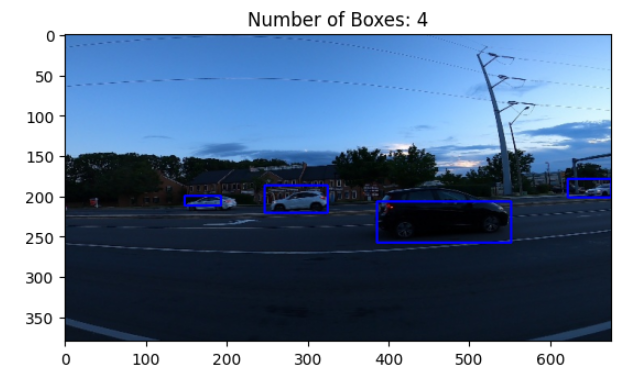

# 🚗 Car Detection Using Selective Search and ResNet50

This project implements a car detection system using Selective Search for region proposals and a deep learning classifier based on **ResNet50** to distinguish between car and non-car regions. The model is trained on a dataset of labeled bounding boxes and images and can detect cars in new images by applying selective search and filtering proposals with the trained classifier.

---

## 📁 Project Structure

```
project/
├── Downloads/archive/data/
│   ├── training_images/
│   ├── testing_images/
│   ├── train_solution_bounding_boxes.csv
├── car_detection.ipynb  # Main detection and training logic
└── README.md
```

---

## 🧰 Dependencies

Make sure to install the required packages:

```bash
pip install opencv-python opencv-contrib-python matplotlib pandas numpy scikit-learn tensorflow
```

---

## 📦 Dataset

* **Images**

  * `training_images/` (1001 images)
  * `testing_images/` (175 images)
* **Bounding Box Annotations**

  * `train_solution_bounding_boxes.csv` contains image names and coordinates: `[image, xmin, ymin, xmax, ymax]`
You can download the dataset from [this Kaggle link](https://www.kaggle.com/datasets/sshikamaru/car-object-detection/data).

---

## 🔍 Project Overview

### 1. **Data Loading & Bounding Box Visualization**

* Reads and displays annotated bounding boxes on images from the training set.
* Helps visualize correct ground truth bounding boxes.

### 2. **Selective Search for Region Proposals**

* Uses OpenCV's `ximgproc.segmentation.createSelectiveSearchSegmentation()` to generate region proposals from images.

### 3. **Intersection over Union (IoU)**

* Calculates IoU to match proposed regions with ground truth:

  ```python
  def get_iou(bb1, bb2)
  ```

### 4. **Dataset Creation**

* For each image:

  * Regions with IoU > 0.5 are labeled as **car (1)**
  * Others are labeled as **non-car (0)**
* Creates a balanced dataset of `(image, label)` pairs, resized to **224x224**

### 5. **Model: ResNet50-based Binary Classifier**

* Uses pre-trained ResNet50 as feature extractor (frozen).
* Adds custom layers for classification:

  * Dense layers with ReLU, BatchNorm, and Dropout
  * Sigmoid output for binary classification

### 6. **Training**

* Compiled with `Adam` optimizer and `binary_crossentropy` loss.
* Trained for 10 epochs using a 85/15 train-validation split.
* Best weights saved using `ModelCheckpoint`.

### 7. **Object Detection Pipeline**

* Takes an input image.
* Applies selective search to generate regions.
* Filters regions using the trained classifier.
* Applies **Non-Maximum Suppression (NMS)** to remove duplicate predictions.
* Draws final bounding boxes on the image.

---

## ✅ Example Output

```python
# Load image and detect cars
photo = cv2.imread("training_images/vid_4_29920.jpg")
car_boxes = perform_object_detection(photo, model)

# Draw detected boxes
image_with_boxes = draw_boxes(photo.copy(), car_boxes)

# Show result
plt.imshow(cv2.cvtColor(image_with_boxes, cv2.COLOR_BGR2RGB))
plt.title(f'Number of Cars Detected: {len(car_boxes)}')
plt.show()
```


---

## 📊 Results

* **Total Region Proposals Processed**: 10,581
* **Model Input Shape**: (224, 224, 3)
* **Classifier Output**: Binary class (Car / Not Car) 98% validation acc 

---

## 🧠 Functions Overview

| Function                                 | Description                                |
| ---------------------------------------- | ------------------------------------------ |
| `get_iou(bb1, bb2)`                      | Compute intersection over union            |
| `perform_object_detection(image, model)` | Detect cars using selective search and CNN |
| `draw_boxes(image, boxes)`               | Draw bounding boxes on the image           |

---

## 📌 Notes

* You can switch between `SelectiveSearchFast` and `SelectiveSearchQuality` for a speed/accuracy trade-off.
* Ensure OpenCV is compiled with `ximgproc` module (`opencv-contrib-python` required).


---

## 📧 Contact

If you have questions or want to contribute, feel free to reach out or open an issue!


